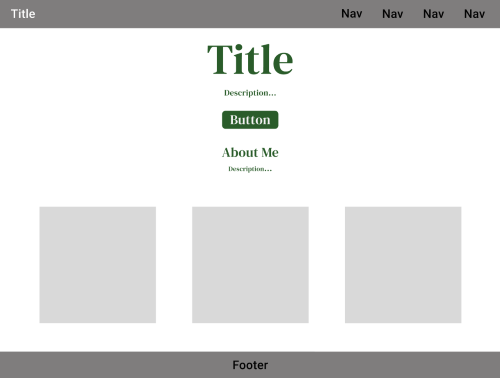

Hi  My name is Ethan Mullins
======================================================================================================================================

I am a junior IT major at the University of North Alabama

* 🌍  I'm based in Tennessee

<p align="left">
<a href="https://docs.microsoft.com/en-us/cpp/?view=msvc-170" target="_blank" rel="noreferrer"></a><a href="https://www.oracle.com/java/" target="_blank" rel="noreferrer"></a><a href="https://developer.mozilla.org/en-US/docs/Web/JavaScript" target="_blank" rel="noreferrer"></a><a href="https://www.php.net/" target="_blank" rel="noreferrer"></a><a href="https://www.python.org/" target="_blank" rel="noreferrer"></a><a href="https://code.visualstudio.com/" target="_blank" rel="noreferrer"></a><a href="https://developer.mozilla.org/en-US/docs/Glossary/HTML5" target="_blank" rel="noreferrer"></a><a href="https://www.w3.org/TR/CSS/#css" target="_blank" rel="noreferrer"></a><a href="https://www.mysql.com/" target="_blank" rel="noreferrer"></a><a href="https://www.figma.com/" target="_blank" rel="noreferrer"></a><a href="https://cloud.google.com/" target="_blank" rel="noreferrer"></a><a href="https://www.raspberrypi.org/" target="_blank" rel="noreferrer"></a>
</p>

### Socials

<p align="left"> <a href="https://www.github.com/EDMullins" target="_blank" rel="noreferrer"> <picture> <source media="(prefers-color-scheme: dark)" srcset="https://raw.githubusercontent.com/danielcranney/readme-generator/main/public/icons/socials/github-dark.svg" /> <source media="(prefers-color-scheme: light)" srcset="https://raw.githubusercontent.com/danielcranney/readme-generator/main/public/icons/socials/github.svg" />  </picture> </a> <a href="https://www.linkedin.com/in/ethan-mullins-03b78b237" target="_blank" rel="noreferrer"> <picture> <source media="(prefers-color-scheme: dark)" srcset="https://raw.githubusercontent.com/danielcranney/readme-generator/main/public/icons/socials/linkedin-dark.svg" /> <source media="(prefers-color-scheme: light)" srcset="https://raw.githubusercontent.com/danielcranney/readme-generator/main/public/icons/socials/linkedin.svg" />  </picture> </a></p>

# EDMullins

## Overview & Page Map

This is a 'lorem ipsum' personal site / portfolio built with **HTML**, **CSS**, **JavaScript**, and **Bootstrap 5**.  
The site contains the following sections/pages:

- **Home / Landing** — A welcome message and intro with projects.  
- **About** — Information sections.  
- **Blog** — Posts or updates.  
- **Resources** — Useful links, tools, or references I use.   
- **Source Code** — Link to the GitHub repo for the site.
- **Accessibility & Checks** - links to wave and nu checker.

## Wireframe



Or view the wireframe here: *[FigmaLink](https://www.figma.com/design/vLFrmlF2nNfwaQowq0cMz9/Untitled?node-id=0-1&t=klDkNwxUdKKlBG7C-1)*

## Live Link

You can view the live site here:  
[EDMullins Portfolio](https://edmullins.github.io/EDMullins/)  

## Code Snippet

Here’s a sample snippet from the HTML that shows the nav bar in 'index.html'

```
<nav class="navbar navbar-expand-lg navbar-dark bg-primary">
		<div class="container-fluid m-2 fw-bolder">
			<!-- "javascript:void(0);" keeps the link from refreshing the page -->
			<a class="navbar-brand" href="javascript:void(0);">Lorem|Dev</a>
			<button class="navbar-toggler" type="button" data-bs-toggle="collapse" data-bs-target="#navbarSupportedContent" aria-controls="navbarSupportedContent" aria-expanded="false" aria-label="Toggle navigation">
				<span class="navbar-toggler-icon"></span>
			</button>
			<div class="collapse navbar-collapse" id="navbarSupportedContent">
				<ul class="navbar-nav ms-auto mb-2 mb-lg-0">
					<li class="nav-item">
						<a class="nav-link" href="pages/about.html">About</a>
					</li>
					<li class="nav-item">
						<a class="nav-link" href="pages/blog.html">Blog</a>
					</li>
					<li class="nav-item">
						<a class="nav-link" href="pages/resources.html">Resources</a>
					</li>
					<li class="nav-item">
						<a class="nav-link" href="https://github.com/EDMullins/EDMullins" target="_blank">Source Code</a>
					</li>
					<li class="nav-item">
						<button class="nav-link bi-moon-fill bg-primary btn" id="darkModeToggle" type="button" value="theme"></button>
					</li>
				</ul>
			</div>
		</div>
	</nav>
 ```

## Tools Used

- Bootstrap
- Bootstrap Icons
- VS Code
- Github
---
